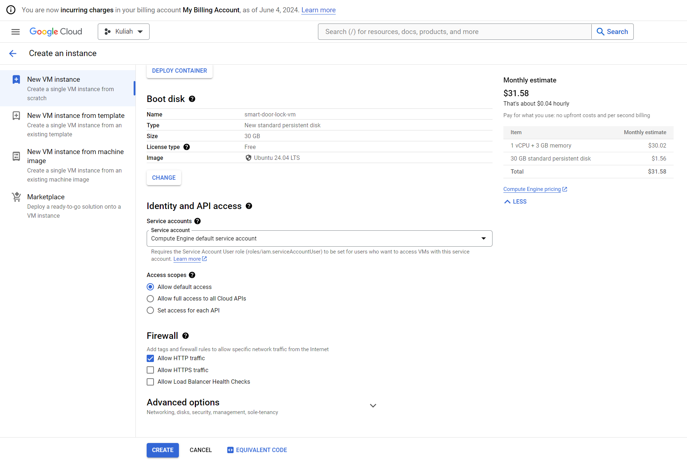
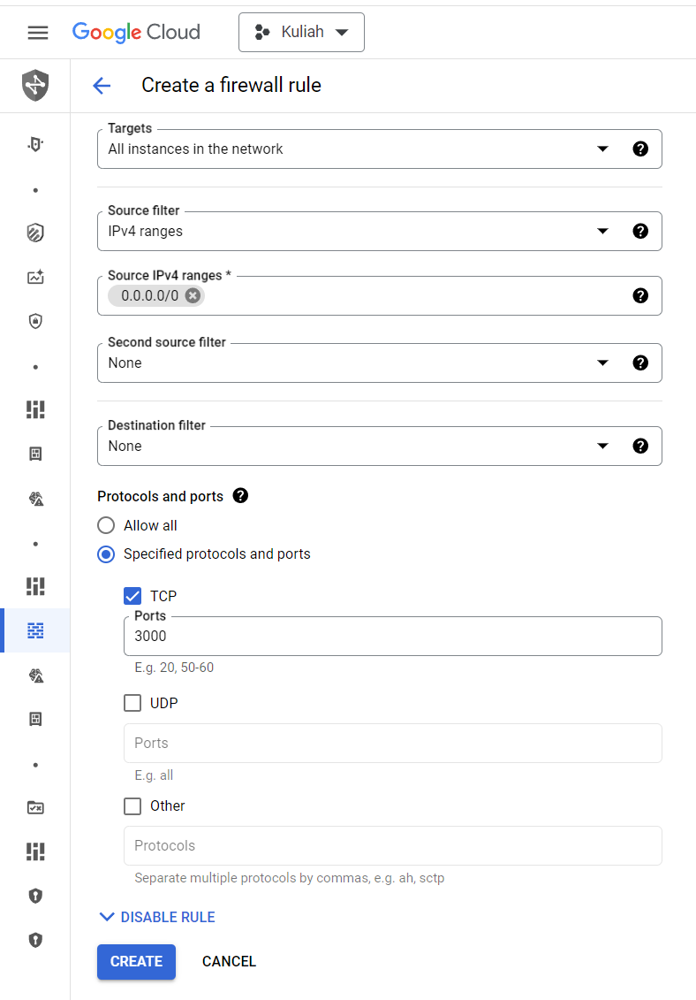

# Deploy laravel backend to GCP  
### Install Dependency  
1. Buat instance, centang http, pilih ubuntu 24 x86/x64  
  
  
2. Buat firewall rule untuk port 3000 dan 8000
  
  
3. Masuk ssh, lalu update package  
```sudo apt-get update```  
```sudo apt-get upgrade```  
  
4. Install apache  
```sudo apt-get install apache2```  
restart apache dengan  
```sudo service apache2 restart```  
  
5. install zip  
```sudo apt-get install zip unzip```  
  
6. install dependency lainnya  
```sudo apt install phpmyadmin php-mbstring php-zip php-gd php-json php-curl```  
  
7. install mysql  
```sudo apt install mysql-server```  
  

### Membuat Database dan Konfigurasi  
  
8. Masuk ke mysql  
```sudo mysql -u root```   
  
9. Buat Database (dalam kasus ini db_smart_door_lock)  
```CREATE DATABASE db_smart_door_lock;```  
Cek database  
```SHOW DATABASES;```  
  
10. Buat User dan passwordnya  
```CREATE USER `ikmal`@`localhost` IDENTIFIED BY 'ikmal123';```  
  
11. Izinkan user pada database  
```GRANT ALL PRIVILEGES ON db_smart_door_lock.* TO `ikmal`@`localhost`;```  
lalu  
```FLUSH PRIVILEGES;```  
lalu keluar dari mysql  
```exit;```  

### Clone Repo dan Migrate  
12. cd ke ```/var/www/html``` lalu clone repo api  
  
13. cd ke repo dan ubah .env.example menjadi .env  
```sudo cp .env.example .env```  
  
14. sesuaikan isi .env sesuai dengan database, username, dan password  
```sudo nano .env```  
  
15. kembali ke path utama dengan cd, lalu install composer  
```curl -sS https://getcomposer.org/installer | php```  
```sudo mv composer.phar /usr/local/bin/composer```  
```sudo chmod +x /usr/local/bin/composer```  
cek jika composer sudah terinstall  
```composer -v```  

16. Set ownership project  
```sudo chown www-data:www-data -R /var/www/html/smart-door-lock-api```   
  
17. cd ke project, lalu composer update, lalu composer install
```cd /var/www/html/smart-door-lock-api/```  
```sudo composer update```  
```sudo composer install```  
  
18. generate key, jwt secret (jika menggunakan jwt), dan migrate
```sudo php artisan key:generate```  
```sudo php artisan jwt:secret```  
```sudo php artisan migrate```  
  
19. Jalankan server dengan host 0.0.0.0  
```sudo php artisan serve --host=0.0.0.0```  

Jika muncul error fatal: detected dubious ownership in repository at '/var/www/html/smart-door-lock-api'  
```git config --global --add safe.directory /var/www/html/smart-door-lock-api```  
```git config --global --get safe.directory```  

# Deploy NextJS to GCP  
1. Install nodejs  
```sudo apt install nodejs```  
  
2. Install npm  
```sudo apt install npm```  

3. Buat .env.local, ubah localhost dengan 'eksternal-ip' vm 
```sudo nano .env.local```  
```NEXT_PUBLIC_API_BACKEND = 'http://localhost:8000'```  

4. install dependency project  
```sudo npm install```  

5. jalankan  
```sudo npm run dev```  

# CI/CD dengan Cloud Build (GCP)  
1. Buat Host Connection lalu hubungkan dengan akun github  
  
2. Hubungkan dengan repository dengan klik 'LINK REPOSITORY'

3. Buka Trigger, lalu Create Trigger, Trigger yang paling dekat adalah Taiwan

4. Event pilih push to a branch, Pilih 2nd gen dan pilih Cloud Build configuration file (cloudbuild.yaml)  

5. Buat file cloudbuild.yaml di direktori root project, kurang lebih isi dari cloudbuild.yaml adalah sbb:  

```
steps:
  # Step 0: Install mysqli (php-mysql) package
  # - name: 'gcr.io/cloud-builders/gcloud'
  #   args:
  #     - 'compute'
  #     - 'ssh'
  #     - 'smart-door-lock-vm'  # compute engine vm name
  #     - '--zone=asia-southeast2-a'  # compute engine zone
  #     - '--command=sudo apt-get update && sudo apt-get install -y mysql-server php-mysql && sudo systemctl restart apache2'

  # Step 1: Deploy the application to Compute Engine VM
  - name: 'gcr.io/cloud-builders/gcloud'
    args:
      - 'compute'
      - 'ssh'
      - 'smart-door-lock-vm'  # compute engine vm name
      - '--zone=asia-southeast2-a'  # compute engine zone instance
      - '--command=cd /var/www/html/smart-door-lock-api && git pull origin main'
    dir: '/var/www/html/smart-door-lock-api'  # location cloned project

  # Step 2: Database migration
  - name: 'gcr.io/cloud-builders/gcloud'
    args:
      - 'compute'
      - 'ssh'
      - 'smart-door-lock-vm'  # compute engine vm name
      - '--zone=asia-southeast2-a'  # compute engine zone instance instance
      - '--command=cd /var/www/html/smart-door-lock-api && php artisan migrate --force'
    dir: '/var/www/html/smart-door-lock-api'  # location cloned project
# Optionally, you can specify the timeout for the entire build process
timeout: '1200s'
```

6. Lalu push projek ke main, nanti projek yang ada pada vm otomatis menjalankan command-command tersebut dan alhasil kode otomatis terupdate.